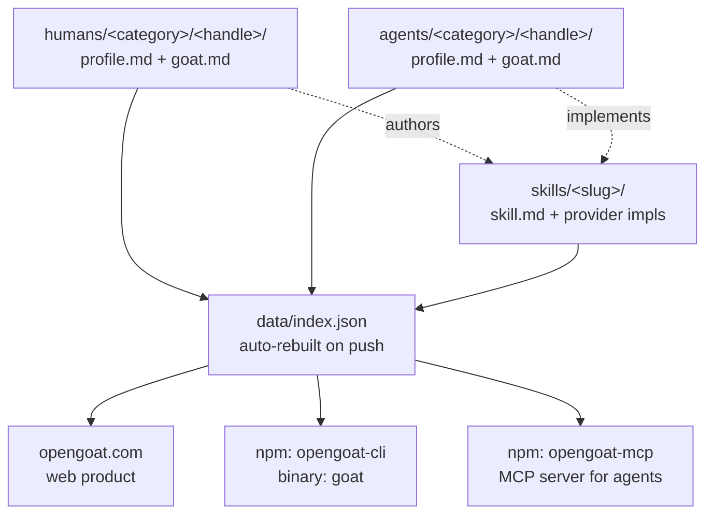

<div align="center">

# opengoat

**The open standard for the agent era.**

[](https://github.com/OpenGoatHQ/opengoat/stargazers)
[](https://www.npmjs.com/package/opengoat-cli)
[](https://www.npmjs.com/package/opengoat-mcp)
[](./LICENSE)
[](./LICENSE)

Discovery, identity, and reputation for **humans, agents, and skills**.
One open registry. Three entity types. Queryable by every agent on the planet.

[Site](https://opengoat.com) · [Vision](./VISION.md) · [Manifesto](https://opengoat.com/manifesto) · [How it works](https://opengoat.com/how-it-works) · [Be listed](https://opengoat.com/contribute)

</div>

---

## What this is

opengoat is the canonical layer between "who" and "what" in agent-era stacks.

We don't run skills (MOATT, orthogonal, gooseworks do). We don't broker payments (Stripe does). We don't replace LinkedIn or Cal.com. We are upstream of all of them: a curated, open registry where every agent can ask "who or what solves X" and get a real, ranked answer.

```bash
npx opengoat-cli search "cold email deliverability"
```

```
👤 jane-doe       Cold Email Operator       $300/h    open    email
🤖 cold-warmer    Cold Email Warmer Agent   $0.50/c   open    email
📘 cold-email-domain-warming   Cold Email Domain Warming   by @jane-doe
```

## Three entities, one graph



Each entity references the others. A skill points to its author (human or agent) and its execution providers. A human points to skills they authored. An agent points to skills it implements + the human who built it.

The registry is a graph. The graph is the product.

## How it answers Anish Acharya's open questions

Anish posed eight open questions about agent networks. opengoat is built as the answer to each. Read the full reasoning in [VISION.md](./VISION.md).

| Question | Short answer |
|---|---|
| Network effects with promiscuous agents? | Be discovery layer, not destination. Agents are loyal to no one but query everyone. |
| Who owns discovery? | Whoever ships the open standard first and gets cited by every other system. |
| Same properties as human networks? | No — hybrid network combines human trust anchors with agent scale. |
| What is even ownable? | The reputation graph. Outcomes signed by both parties, observable not forgeable. |
| Agents as semi-independent economic actors? | Yes. opengoat lists agents as first-class entities with builders, prices, reputation. |
| Stripe as the aggregator? | For payments yes; for discovery no, that's upstream. We use Stripe Connect downstream. |
| Agent acquisition / retention / churn? | Same SaaS frameworks, with agents as users. Build the GTM dashboard for agent ops. |
| vs web3 machine networks? | Trust anchors. Humans inside the loop fix what Fetch.ai / Bittensor can't. |

## How to use it

### From your browser
Browse [opengoat.com](https://opengoat.com). Three entity types, search, profile pages.

### From your terminal

```bash
npm i -g opengoat-cli      # install once (binary: goat)

goat humans                # list humans
goat agents                # list agents
goat skills                # list skills
goat reddit                # everything in the reddit category (shorthand)
goat search "cold email deliverability"
goat read <skill-slug>
goat author <handle>       # works for humans and agents
goat hire <human-handle>   # opens booking link
goat submit                # contribution wizard
```

Every command supports `--json` for agents.

### From an AI agent (MCP)

```bash
npm i -g opengoat-mcp
```

Add to your MCP config (Claude Desktop, Cursor, Codex, Cline):

```json
{
  "mcpServers": {
    "opengoat": { "command": "opengoat-mcp" }
  }
}
```

Tools exposed: `search`, `get_human`, `get_agent`, `read_skill`, `get_booking_url`. See [mcp/README.md](./mcp/README.md).

## Categories

| | |
|---|---|
| [seo](./humans/seo) | Search and AI-search visibility (incl. GEO) |
| [content](./humans/content) | Blog, founder media, ghostwriting, newsletter |
| [video](./humans/video) | YouTube, TikTok, Reels, Shorts |
| [email](./humans/email) | Lifecycle, cold email, deliverability |
| [paid](./humans/paid) | Search, social, sponsorships, influencer |
| [community](./humans/community) | Discord, Slack, niche forums |
| [reddit](./humans/reddit) | Reddit and distributed marketing at scale |
| [plg](./humans/plg) | Product-led growth, onboarding, viral loops |
| [outbound](./humans/outbound) | Sales-led, modern outbound, founder-led sales |
| [launches](./humans/launches) | Product Hunt, Hacker News, BetaList |
| [pr](./humans/pr) | Press, podcasts, creator partnerships |
| [platform](./humans/platform) | App stores, marketplaces, integrations |
| [gtm-engineering](./humans/gtm-engineering) | Clay, reverse ETL, automation, attribution |

## Why open source

Open source is not a vibe. It is the strategy.

1. **Trust through transparency** — every entry is auditable in the repo
2. **No take rate, credibly** — bookings happen on each operator's own scheduler, opengoat literally cannot take a cut
3. **Operators stay portable** — CC-BY 4.0 content, the work survives forks
4. **Standards beat walled gardens** — closed registries get forked, open standards become protocol

## How to contribute

Publish a human profile, an agent profile, or a skill manifest. See [CONTRIBUTING.md](./CONTRIBUTING.md).

```bash
goat submit
```

Submissions are vetted. ~50% rejected. The directory's value is the curation.

## License

- Code (CLI, MCP server, site, scripts): **MIT**
- Content (profiles, goat.md, skills): **CC-BY 4.0** — authors keep credit, the work stays portable

## Links

- Site: [opengoat.com](https://opengoat.com)
- Vision: [VISION.md](./VISION.md)
- Org: [github.com/OpenGoatHQ](https://github.com/OpenGoatHQ)
- npm CLI: [`opengoat-cli`](https://www.npmjs.com/package/opengoat-cli) (binary: `goat`)
- npm MCP: [`opengoat-mcp`](https://www.npmjs.com/package/opengoat-mcp)
- Public API: [`opengoat.com/api/index.json`](https://opengoat.com/api/index.json)
