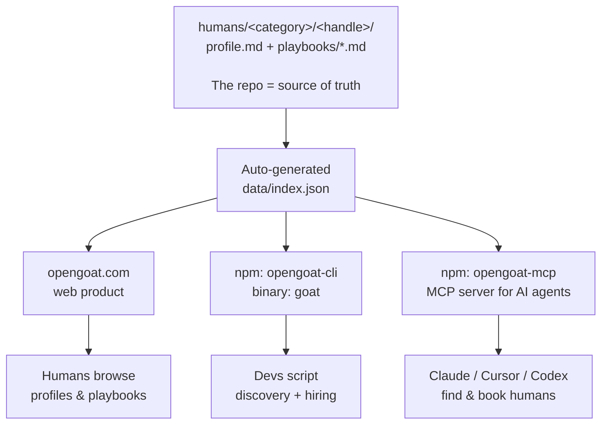

<div align="center">

# opengoat

**The moat in the agent era isn't agents. It's the humans who operate them.**

[](https://github.com/OpenGoatHQ/opengoat/stargazers)
[](https://www.npmjs.com/package/opengoat-cli)
[](https://www.npmjs.com/package/opengoat-mcp)
[](./LICENSE)
[](./LICENSE)

Curated · invite-priority · ~50% of submissions rejected · no take rate

[Site](https://opengoat.com) · [Manifesto](https://opengoat.com/manifesto) · [How it works](https://opengoat.com/how-it-works) · [Be listed](https://opengoat.com/contribute)

</div>

---

## What this is

Skills get commoditized. Tools are APIs. What stays defensible is the curated network of humans whose judgment, identity, and accumulated reputation can't be forked.

opengoat is the registry of those humans — open, queryable from your terminal, callable by your AI agents, bookable by anyone.

```bash
npx opengoat-cli reddit                              # list reddit operators
npx opengoat-cli search "cold email deliverability"  # full-text search
```

```
📘 cold-email-domain-warming         from $5,000  ⏱ 4-6 weeks  agent-executable
   Bring a fresh sending domain to 5%+ reply rates. Authored by @<handle>...

📘 high-volume-cold-outreach         from $12,000 ⏱ ongoing    human required
   Sustained cold campaigns at 1k+ sends/day with deliverability protected...

👤 <handle> — Cold email operator since 2019. Anti-spec: bot networks.
```

## How it works



Each operator's profile is markdown with structured frontmatter. Each playbook is a **skill manifest** agents can parse:

```yaml
---
name: Cold Email Domain Warming Protocol
when_to_use: [Fresh sending domain, Reply rates below 2%]
when_not_to_use: [Existing warm domain, Under 100 emails/day]
prerequisites: [Owned domain, SPF/DKIM/DMARC access]
duration: 4-6 weeks
human_required: false
cost_hire_min_usd: 5000
cost_hire_max_usd: 15000
---
```

Agents read this and decide: execute the playbook themselves, or surface the operator to the user for hiring.

## Three surfaces, one source of truth

| Audience | Surface | What it does |
|---|---|---|
| **Humans browsing** | [opengoat.com](https://opengoat.com) | Beautiful profiles, playbook pages, search, booking links |
| **Devs scripting** | `npm: opengoat-cli` (binary `goat`) | Terminal search, JSON output, scriptable hiring |
| **AI agents** | `npm: opengoat-mcp` | MCP server, 4 tools, native Claude/Cursor/Codex integration |

All three read from `data/index.json`, auto-rebuilt on every push. The repo stays the source of truth — no separate database, no sync layer, no vendor lock-in.

## Categories

| | |
|---|---|
| [seo/](./humans/seo) | Search and AI-search visibility (incl. GEO) |
| [content/](./humans/content) | Blog, founder media, ghostwriting, newsletter |
| [video/](./humans/video) | YouTube, TikTok, Reels, Shorts |
| [email/](./humans/email) | Lifecycle, cold email, deliverability |
| [paid/](./humans/paid) | Search, social, sponsorships, influencer |
| [community/](./humans/community) | Discord, Slack, niche forums |
| [reddit/](./humans/reddit) | Reddit and distributed marketing at scale |
| [plg/](./humans/plg) | Product-led growth, onboarding, viral loops |
| [outbound/](./humans/outbound) | Sales-led, modern outbound, founder-led sales |
| [launches/](./humans/launches) | Product Hunt, Hacker News, BetaList |
| [pr/](./humans/pr) | Press, podcasts, creator partnerships |
| [platform/](./humans/platform) | App stores, marketplaces, integrations |
| [gtm-engineering/](./humans/gtm-engineering) | Clay, reverse ETL, automation, attribution |

## How to use it

### From your browser
Browse [humans/](./humans). Read a playbook. Click the booking link in the author's profile. Direct booking. We take 0%.

### From your terminal

```bash
npm i -g opengoat-cli      # install once (binary: goat)
# or: npx opengoat-cli <command>

goat reddit                                # list reddit operators (shorthand)
goat seo                                   # list seo operators
goat list --available                      # all humans accepting bookings
goat search "cold email deliverability"
goat read <playbook-slug>
goat author <handle>
goat hire <handle>                         # opens booking link
goat submit                                # contribution wizard
```

Every command supports `--json` for agents. See [cli/README.md](./cli/README.md).

### From an AI agent (MCP)

```bash
npm i -g opengoat-mcp
```

Add to your MCP config (Claude Desktop, Cursor, Codex, Cline):

```json
{
  "mcpServers": {
    "opengoat": { "command": "opengoat-mcp" }
  }
}
```

Tools exposed: `search_humans`, `read_playbook`, `get_author`, `get_booking_url`. See [mcp/README.md](./mcp/README.md).

## How it compares

| | opengoat | LinkedIn | Upwork | Intro.co | Clarity.fm |
|---|---|---|---|---|---|
| Open-source registry | ✅ | ❌ | ❌ | ❌ | ❌ |
| Take rate | **0%** | n/a (recruiter SaaS) | 10% | 20% | 15% |
| Curated / invite-priority | ✅ | ❌ | ❌ | ✅ | ❌ |
| CLI access | ✅ | ❌ | ❌ | ❌ | ❌ |
| MCP / agent-native | ✅ | ❌ | ❌ | ❌ | ❌ |
| Operators publish playbooks | ✅ | ❌ | ❌ | ❌ | ❌ |
| Direct booking | ✅ (Cal.com) | ❌ | platform-mediated | platform-mediated | platform-mediated |
| Vetting bar | ~50% rejected | ❌ | ❌ | invite-only | ❌ |

## How to contribute

Publish a profile + at least one real playbook.

```bash
goat submit
```

Submissions are vetted. Generic, AI-generated, or self-promotional content is rejected. The registry's value is the curation. See [CONTRIBUTING.md](./CONTRIBUTING.md).

## Roadmap

**v0.1 — Registry online (current)**
- ✅ Schema + 13 categories
- ✅ CLI shipped (`opengoat-cli`, binary `goat`)
- ✅ MCP server shipped (`opengoat-mcp`)
- ✅ Site shipped (Next.js, opengoat.com)
- ✅ GitHub Actions for auto-rebuild + PR verify

**v0.2 — Supply seeding**
- First 30 vetted operators
- First 50 published playbooks
- Interactive CLI submit wizard
- Preview deploys on PR (review submissions visually)

**v0.3 — Demand activation**
- Featured playbook of the week
- Newsletter (new operators / playbooks)
- Twitter / Show HN launch
- First 1k stars

**v1.0 — Compound**
- 100+ operators across 13 categories
- 200+ playbooks indexed
- MCP install across major agent clients
- Verified-operator badge (KYC + reference checks)
- "OpenGoat-certified" as a real signal

**v2.0 (later) — monetization optional**
- Premium analytics for operators (profile views, booking conversion)
- "Recruiter-tier" search for hiring teams (paid)
- Sponsored category placements (disclosed)
- Still: no take rate on bookings.

## License

- Code (CLI, MCP server, site, scripts): **MIT**
- Content (profiles, playbooks): **CC-BY 4.0** — authors keep credit, the work stays portable.

## Links

- Site: [opengoat.com](https://opengoat.com)
- Org: [github.com/OpenGoatHQ](https://github.com/OpenGoatHQ)
- npm CLI: [`opengoat-cli`](https://www.npmjs.com/package/opengoat-cli) (binary: `goat`)
- npm MCP: [`opengoat-mcp`](https://www.npmjs.com/package/opengoat-mcp)
- API: [`opengoat.com/api/index.json`](https://opengoat.com/api/index.json)
